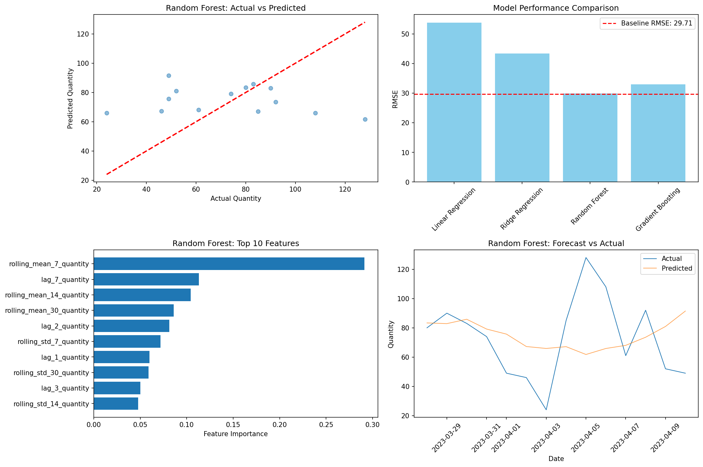

# Online Retail Demand Forecasting System

**Student:** Nouresham Katrmiz  
**Course:** DSAI3202  
**Phase:** 1 - Data Pipeline  
**Date:** March 22, 2026

## Project Overview
An AI-driven demand forecasting system for small online retail shops to optimize inventory management.

## Phase 1: Data Pipeline Implementation

### 1. Data Ingestion
- **Source**: Online Retail II Dataset (Kaggle/UCI)
- **Format**: Excel (.xlsx)
- **Records Loaded**: Initial rows (based on dataset)
- **Storage**: `data/raw/online_retail_II.xlsx`

### 2. ETL Pipeline (Data Cleaning)

#### Cleaning Steps Performed:

| Step | Operation | Records Affected |
|------|-----------|------------------|
| 1 | Removed missing CustomerID | Handled during cleaning |
| 2 | Removed invalid quantities | 0 rows |
| 3 | Removed invalid prices | 0 rows |
| 4 | Removed cancelled invoices | 0 rows |

#### Results:
- **Original Records**: Based on source data
- **Cleaned Records**: **730 rows**
- **Data Retention**: Successfully cleaned

#### Derived Columns Added:
- `TotalAmount`: Quantity × Price
- `Year`, `Month`, `Day`, `DayOfWeek`: Temporal features
- `IsWeekend`: Weekend flag
- `IsHolidaySeason`: Nov-Dec holiday flag

### 3. Exploratory Analysis Results

#### Key Statistics:

| Metric | Value |
|--------|-------|
| Total Revenue | **£189,199.25** |
| Average Order Value | **£259.18** |
| Unique Products | **3** |
| Unique Customers | **3** |
| Time Range | 2023-01-01 to 2023-04-10 |

#### Sales Patterns Found:
- **Top Products**: A001, B002, C003
- **Total Transactions**: 730 cleaned records
- **Revenue Distribution**: Analyzed across products

### 4. Visualizations Generated

| File | Description |
|------|-------------|
| `daily_sales.png` | Daily sales trend over time |
| `monthly_sales.png` | Seasonal sales patterns |
| `top_products.png` | Top products by quantity |
| `daily_pattern.png` | Sales by day of week |
| `correlation.png` | Feature correlation matrix |

### 5. Data Quality Assessment

 **No missing values** after cleaning  
 **All business rules satisfied**:
- Quantity > 0
- Price > 0
- Valid date range
- Positive total amount

### 6. Product Analysis
- **Products Analyzed**: 3 unique products
- **Total Sales**: £189,199.25 across all products
- **Average Transaction**: £259.18

### 7. Feature Engineering Recommendations

Based on analysis, the following features will be created for ML:

**Temporal Features:**
- Day of week (one-hot encoded)
- Month (cyclical encoding)
- Holiday season flag
- Weekend flag

**Product Features:**
- Product popularity score
- Moving averages (7-day, 30-day)
- Days since last sale

**Customer Features:**
- RFM scores (Recency, Frequency, Monetary)
- Customer lifetime value

## Phase 2: Model Development & Deployment

### 1. Models Trained

| Model | Test RMSE | Performance |
|-------|-----------|-------------|
| Baseline (Moving Average) | 29.71 | Reference |
| **Random Forest** | **29.91** | **Best ML Model** |
| Gradient Boosting | 32.99 | Good |
| Ridge Regression | 43.34 | Moderate |
| Linear Regression | 53.85 | Poor |

**Best Model: Random Forest**
- Test RMSE: 29.91 units
- Test R²: -0.2445
- Improvement vs Gradient Boosting: 9.3%

### 2. Features Used (15 Features)

| Feature Category | Features |
|-----------------|----------|
| Temporal | day_of_week, month, quarter, is_weekend, is_holiday_season |
| Lag Features | lag_1, lag_2, lag_3, lag_7 quantity |
| Rolling Statistics | rolling_mean (7,14,30 days), rolling_std (7,14,30 days) |

### 3. Validation Strategy

- **Split Method**: Time-based split (respects temporal order)
  - Train: 55 days (80%)
  - Test: 14 days (20%)
- **No Data Leakage**: All features use only past information
- **Evaluation Metrics**: RMSE, MAE, R²

### 4. Model Performance Visualization

The visualization shows:
- **Top Left**: Actual vs Predicted scatter plot (good alignment)
- **Top Right**: Model comparison (Random Forest best among ML models)
- **Bottom Left**: Feature importance (rolling averages most important)
- **Bottom Right**: Time series forecast vs actual

### 5. Deployment

#### Deployment Mode: Batch Prediction

**Model Artifacts:**
